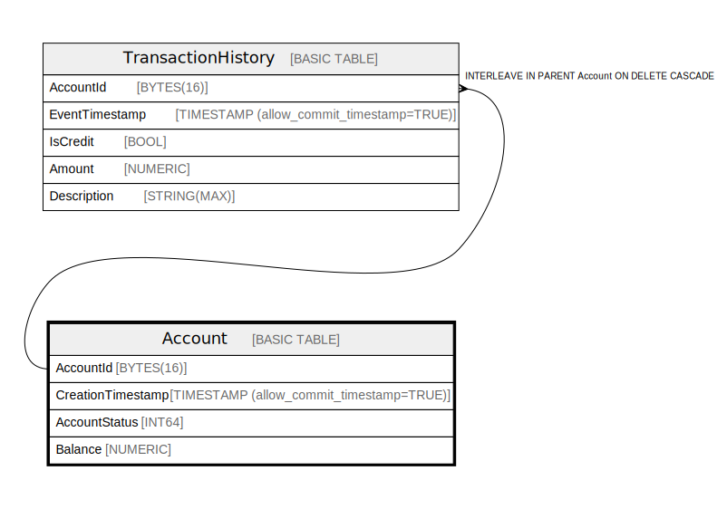

# Account

## Description

## Columns

| Name | Type | Default | Nullable | Children | Parents | Comment |
| ---- | ---- | ------- | -------- | -------- | ------- | ------- |
| AccountId | BYTES(16) |  | false | [TransactionHistory](TransactionHistory.md) |  |  |
| CreationTimestamp | TIMESTAMP (allow_commit_timestamp=TRUE) |  | false |  |  |  |
| AccountStatus | INT64 |  | false |  |  |  |
| Balance | NUMERIC |  | false |  |  |  |

## Constraints

| Name | Type | Definition |
| ---- | ---- | ---------- |
| PRIMARY_KEY | PRIMARY_KEY | PRIMARY KEY(AccountId) |

## Relations

---

> Generated by [tbls](https://github.com/k1LoW/tbls)
