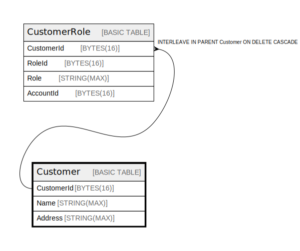

# Customer

## Description

## Columns

| Name | Type | Default | Nullable | Children | Parents | Comment |
| ---- | ---- | ------- | -------- | -------- | ------- | ------- |
| CustomerId | BYTES(16) |  | false | [CustomerRole](CustomerRole.md) |  |  |
| Name | STRING(MAX) |  | false |  |  |  |
| Address | STRING(MAX) |  | false |  |  |  |

## Constraints

| Name | Type | Definition |
| ---- | ---- | ---------- |
| PRIMARY_KEY | PRIMARY_KEY | PRIMARY KEY(CustomerId) |

## Relations

---

> Generated by [tbls](https://github.com/k1LoW/tbls)
