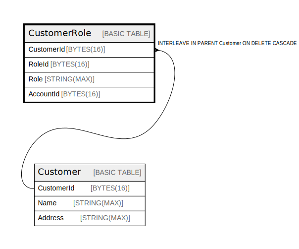

# CustomerRole

## Description

## Columns

| Name | Type | Default | Nullable | Children | Parents | Comment |
| ---- | ---- | ------- | -------- | -------- | ------- | ------- |
| CustomerId | BYTES(16) |  | false |  | [Customer](Customer.md) |  |
| RoleId | BYTES(16) |  | false |  | [Customer](Customer.md) |  |
| Role | STRING(MAX) |  | false |  |  |  |
| AccountId | BYTES(16) |  | false |  |  |  |

## Constraints

| Name | Type | Definition |
| ---- | ---- | ---------- |
| PRIMARY_KEY | PRIMARY_KEY | PRIMARY KEY(CustomerId, RoleId) |
| INTERLEAVE | INTERLEAVE | INTERLEAVE IN PARENT Customer ON DELETE CASCADE |

## Indexes

| Name | Definition |
| ---- | ---------- |
| IDX_CustomerRole_AccountId_D7E260B2AC232A37 | CREATE INDEX IDX_CustomerRole_AccountId_D7E260B2AC232A37 ON CustomerRole (AccountId) |
| CustomerRoleByAccount | CREATE INDEX CustomerRoleByAccount ON CustomerRole (AccountId, CustomerId) |

## Relations

---

> Generated by [tbls](https://github.com/k1LoW/tbls)
