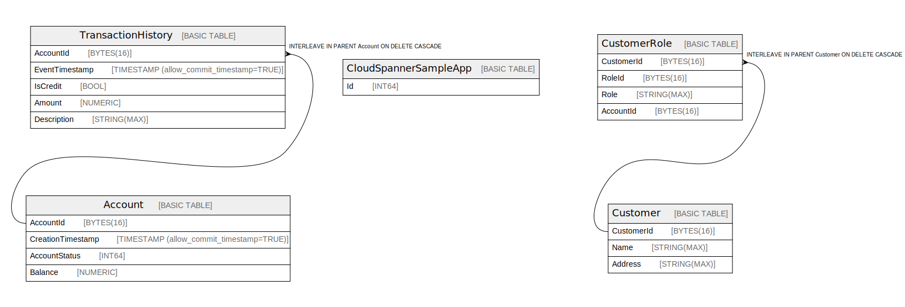

# projects/valiant-song-420805/instances/test-instance/databases/finance-db

## Tables

| Name | Columns | Comment | Type |
| ---- | ------- | ------- | ---- |
| [Account](Account.md) | 4 |  | BASIC TABLE |
| [CloudSpannerSampleApp](CloudSpannerSampleApp.md) | 1 |  | BASIC TABLE |
| [Customer](Customer.md) | 3 |  | BASIC TABLE |
| [CustomerRole](CustomerRole.md) | 4 |  | BASIC TABLE |
| [TransactionHistory](TransactionHistory.md) | 5 |  | BASIC TABLE |

## Relations

---

> Generated by [tbls](https://github.com/k1LoW/tbls)
